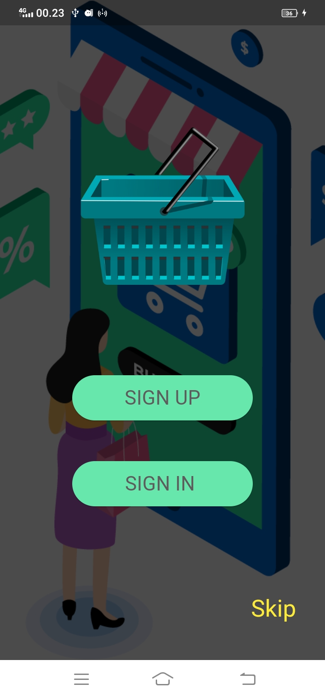

# Nama Aplikasi
 

Program food delivery adalah sebuah sistem atau aplikasi yang memungkinkan pelanggan untuk memesan makanan dari restoran atau penjual makanan melalui platform online atau perangkat seluler. Dalam program ini, pelanggan dapat memilih menu makanan yang mereka inginkan, menentukan jumlah atau porsi, dan melakukan pembayaran secara elektronik.Program food delivery telah menjadi solusi populer bagi banyak orang yang ingin menikmati makanan dari restoran favorit mereka tanpa harus pergi ke tempat tersebut. Ini juga memberikan peluang bisnis bagi restoran atau penjual makanan untuk mencapai pelanggan lebih luas melalui platform online.

## Nama Kelompok
<table border="1">
  <thead>
    <tr>
      <td>No</td>
      <td>NIM</td>
      <td>Nama Anggota</td>
    </tr>
  <thead>
  <tbody>
    <tr>
      <td>1</td>
      <td>15220644</td>
      <td>Rafi Fulvian</td>
    </tr>
    <tr>
      <td>2</td>
      <td>15220212</td>
      <td>Silvester Fabian</td>
    </tr>
    <tr>
      <td>3</td>
      <td>15220069</td>
      <td>Syaeiful Rochman</td>
    </tr>
    <tr>
      <td>4</td>
      <td>15220032</td>
      <td>Mohammad Fikri Khoiruddin</td>
    </tr>
  </tbody>
</table>

## 💻 Pengguna Sistem
Pengguna yang dapat memakai sistem ini adalah user

## 👨‍💻 Skenario Kebutuhan Pengguna

### User
<ol>
  <li>User bisa membuat akun login/sign up & user dapat melakukan login dengan account yang sudah di daftarkan</li>
  <li>User memilih product yang bisa di pesan berdasarkan sumber yang diinginkan</li>
  <li>User dapat melihat jumlah product yang di pesan & harga yang perlu dibayarkan</li>
</ol>

## 🖼️ Screenshot Aplikasi
<table width="100%">
  <tbody>
    <tr>
      <td width="33%">
        <h5>Splash screen</h5>
         
      </td>
      <td width="33%">
        <h5>Login Screen</h5>
        
      </td>
      <td width="33%">
        <h5>Create account</h5>
        
      </td>
    </tr>
    <tr>
      <td width="33%">
        <h5>Profile account</h5>
         
      </td>
      <td width="33%">
        <h5>Katalog product</h5>
        
      </td>
      <td width="33%">
        <h5>Keranjang pembayaran</h5>
        
      </td>
    </tr>
  </tbody>
</table>
<!-- Boleh tambahkan jumlah screenshot lebih dari 3 gambar agar lebih lengkap dalam pengenalan aplikasinya -->

## 📝 Prerequisite
Untuk menjalankan aplikasi ini disarankan untuk menyiapkan aplikasi berikut ini :
  - [x] Android Studio Giraffe <code>2022.03.1 Patch 1</code>
  - [x] Flutter <code>3.13.2</code>
  - [x] Dart <code>3.1.0</code>
  - [x] Java JDK <code>19.0.0</code>
  - [x] Git <code>2.35.1</code>

## Credit
Project ini mengacu pada modul praktik dari mata kuliah Mobile Programming Universitas Bina Sarana Informatika (UBSI) yang diampu oleh Bpk. <a href="https://github.com/yuris60">Yuris Alkhalifi, M.Kom., CPDSA</a> selaku Dosen.
